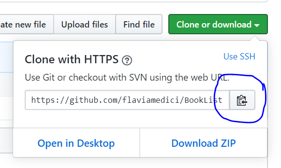
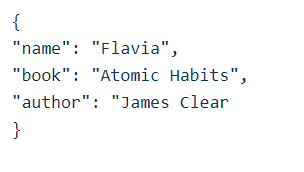

# BookList
[](http://makeapullrequest.com)

Please watch the video [How to Contribute to an Open Source Project on GitHub](https://egghead.io/courses/how-to-contribute-to-an-open-source-project-on-github).

#### This repo is just for you to add a book to the list for your first pull request. In the future, I plan to gather all the books and make a small project to display the book list.

# Steps
##### 1. Fork this repository
Fork this repository by clicking on the fork button on the top of this page. This will create a copy of this repository in your account.

##### 2. Clone the repository
clone this repository

Now clone the forked repository to your machine. Go to your GitHub account, open the forked repository, click on the clone button and then click the copy to clipboard icon.

##### 3. Run the following git command on the terminal ( I use the terminal on VSCode going to View -> Terminal):

```
git clone "url"
```


##### 4. Open the repository folder
```
cd BookList
```
##### 5. Now open BookList.json file in a text editor, add your favorite book (or books, it's up to you) to it and author. Put it anywhere in between. Now, save the file.
Make sure to follow the format:


##### 6. Save the file and check the changes using the command:
```
git status
```
##### 7. Add the changes using the git add command:
```
git add BookList.json
```
##### 8. Commit those changes using git commit:
```
git commit -m "Add your message"
```
##### 9. Push changes to GitHub using the command git push:
```
git push origin master
```
##### 10. create a pull request
Go to your repository on GitHub, you'll see pull request green button. Click on that button.

##### 11. Submit the pull Request

##### 12. Congratulations!!! You have just submitted your first pull request and contribute to open source.
